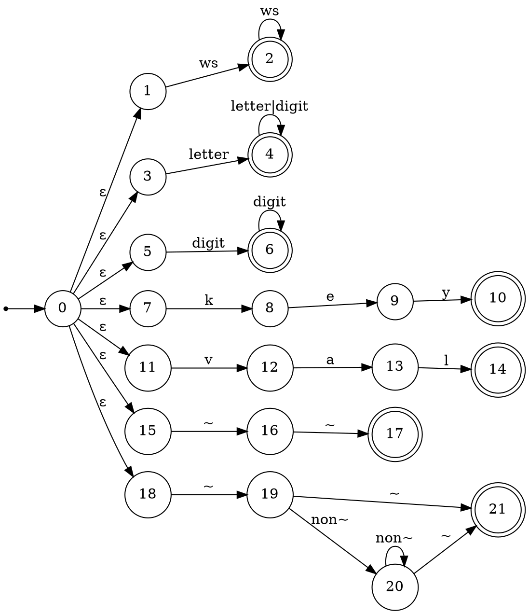
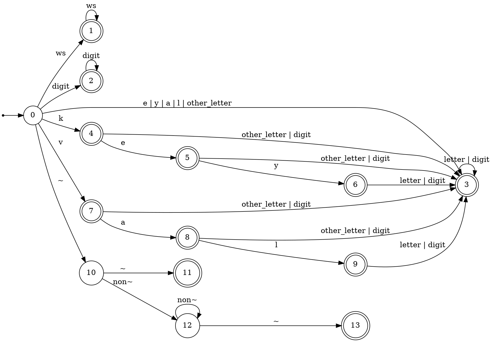

% Лабораторная работа № 1.4 «Лексический распознаватель»
% 18 марта 2026 г.
% Дмитрий Трофименко, ИУ9-62Б

# Цель работы
Целью данной работы является изучение использования детерминированных конечных автоматов с размеченными 
заключительными состояниями (лексических распознавателей) для решения задачи лексического анализа.

# Индивидуальный вариант
key, val, ~~, комментарии ограничены знаками ~, могут пересекать границы строк текста.

# Реализация

Лексическая структура языка — регулярные выражения для доменов:

* WS       = `[ \t\r\n]+`
* IDENT    = `[A-Za-z][A-Za-z0-9]*`
* INT      = `[0-9]+`
* KEYWORD  = `key|val`
* OP       = `~~`
* COMMENT  = `~([^~])*~`

Граф недетерминированного распознавателя:



Граф детерминированного распознавателя:



Реализация распознавателя:

Файл `lexer.py`:
```python
TAG_WS = "WS"
TAG_IDENT = "IDENT"
TAG_INT = "INT"
TAG_KEYWORD = "KEYWORD"
TAG_OP = "OP"
TAG_COMMENT = "COMMENT"
TAG_EOF = "EOF"

CLASS_WS = 0
CLASS_DIGIT = 1
CLASS_K = 2
CLASS_E = 3
CLASS_Y = 4
CLASS_V = 5
CLASS_A = 6
CLASS_L = 7
CLASS_TILDE = 8
CLASS_OTHER_LETTER = 9
CLASS_OTHER = 10

CLASS_NAMES = [
    "WS",
    "DIGIT",
    "K",
    "E",
    "Y",
    "V",
    "A",
    "L",
    "TILDE",
    "OTHER_LETTER",
    "OTHER",
]

def build_generalized_symbols():
    arr = [CLASS_OTHER] * 128

    for ch in " \t\n\r":
        arr[ord(ch)] = CLASS_WS

    for ch in "0123456789":
        arr[ord(ch)] = CLASS_DIGIT

    arr[ord("k")] = CLASS_K
    arr[ord("e")] = CLASS_E
    arr[ord("y")] = CLASS_Y
    arr[ord("v")] = CLASS_V
    arr[ord("a")] = CLASS_A
    arr[ord("l")] = CLASS_L
    arr[ord("~")] = CLASS_TILDE

    letters = "ABCDEFGHIJKLMNOPQRSTUVWXYZabcdefghijklmnopqrstuvwxyz"
    for ch in letters:
        if ch not in "keyval":
            arr[ord(ch)] = CLASS_OTHER_LETTER

    return arr

GENERALIZED_SYMBOLS = build_generalized_symbols()

TRANSITIONS = [
    [1, 2, 4, 3, 3, 7, 3, 3, 10, 3, -1],
    [1, -1, -1, -1, -1, -1, -1, -1, -1, -1, -1],
    [-1, 2, -1, -1, -1, -1, -1, -1, -1, -1, -1],
    [-1, 3, 3, 3, 3, 3, 3, 3, -1, 3, -1],
    [-1, 3, 3, 5, 3, 3, 3, 3, -1, 3, -1],
    [-1, 3, 3, 3, 6, 3, 3, 3, -1, 3, -1],
    [-1, 3, 3, 3, 3, 3, 3, 3, -1, 3, -1],  
    [-1, 3, 3, 3, 3, 3, 8, 3, -1, 3, -1],
    [-1, 3, 3, 3, 3, 3, 3, 9, -1, 3, -1],
    [-1, 3, 3, 3, 3, 3, 3, 3, -1, 3, -1],
    [12, 12, 12, 12, 12, 12, 12, 12, 11, 12, 12],
    [-1, -1, -1, -1, -1, -1, -1, -1, -1, -1, -1],
    [12, 12, 12, 12, 12, 12, 12, 12, 13, 12, 12],
    [-1, -1, -1, -1, -1, -1, -1, -1, -1, -1, -1],
]

FINALS = [
    None,
    TAG_WS,
    TAG_INT,
    TAG_IDENT,
    TAG_IDENT,
    TAG_IDENT,
    TAG_KEYWORD,
    TAG_IDENT,
    TAG_IDENT,
    TAG_KEYWORD,
    None,
    TAG_OP,
    None,
    TAG_COMMENT,
]

IGNORED_TAGS = [TAG_WS]

class Position:
    def __init__(self, index, line, column):
        self.index = index
        self.line = line
        self.column = column

    def copy(self):
        return Position(self.index, self.line, self.column)

    def advance(self, ch):
        self.index += 1
        if ch == "\n":
            self.line += 1
            self.column = 1
        else:
            self.column += 1

class Fragment:
    def __init__(self, start, follow):
        self.start = start
        self.follow = follow

    def __str__(self):
        return "(({}, {}), ({}, {}))".format(
            self.start.line,
            self.start.column,
            self.follow.line,
            self.follow.column
        )

class Token:
    def __init__(self, tag, fragment, lexeme):
        self.tag = tag
        self.fragment = fragment
        self.lexeme = lexeme

    def __str__(self):
        return "{} {}: {}".format(
            self.tag,
            self.fragment,
            escape_lexeme(self.lexeme)
        )

def escape_lexeme(s):
    result = []
    for ch in s:
        if ch == "\n":
            result.append("\\n")
        elif ch == "\t":
            result.append("\\t")
        elif ch == "\r":
            result.append("\\r")
        elif ch == "\\":
            result.append("\\\\")
        else:
            result.append(ch)
    return "".join(result)

class Lexer:
    def __init__(self, text):
        self.text = text
        self.position = Position(0, 1, 1)

    def class_of(self, ch):
        code = ord(ch)
        if 0 <= code < 128:
            return GENERALIZED_SYMBOLS[code]
        return -1

    def nextToken(self):
        while True:
            if self.position.index >= len(self.text):
                p = self.position.copy() 
                return Token(TAG_EOF, Fragment(p, p.copy()), "")

            token = self.read_one_token()

            if token is None:
                continue

            if token.tag in IGNORED_TAGS:
                continue

            return token

    def read_one_token(self):
        start = self.position.copy()
        probe = self.position.copy()
        state = 0

        last_final_state = -1
        last_final_position = None

        while probe.index < len(self.text):
            ch = self.text[probe.index]
            cls = self.class_of(ch)

            if cls == -1:
                next_state = -1
            else:
                next_state = TRANSITIONS[state][cls]

            if next_state == -1:
                break

            state = next_state
            probe.advance(ch)

            if FINALS[state] is not None:
                last_final_state = state
                last_final_position = probe.copy()

        if last_final_state != -1:
            lexeme = self.text[start.index:last_final_position.index]
            token = Token(
                FINALS[last_final_state],
                Fragment(start.copy(), last_final_position.copy()),
                lexeme
            )
            self.position = last_final_position.copy()
            return token

        if state == 10 or state == 12:
            if probe.index >= len(self.text):
                print(
                    "Лексическая ошибка в {}:{}: незавершённый комментарий".format(
                        start.line,
                        start.column
                    )
                )
                self.position = probe.copy()
                return None

        bad = self.text[self.position.index]
        print(
            "Лексическая ошибка в {}:{}: неожиданный символ {}".format(
                start.line,
                start.column,
                repr(bad)
            )
        )
        self.position.advance(bad)
        return None

def main():
    try:
        with open(r"input.txt", "r", encoding="ascii") as f:
            text = f.read()
    except FileNotFoundError:
        print("Файл не найден")
        return
    except UnicodeDecodeError:
        print("Ошибка: входной файл должен быть ASCII")
        return

    lexer = Lexer(text)

    while True:
        token = lexer.nextToken()
        if token.tag == TAG_EOF:
            break
        print(token)

if __name__ == "__main__":
    main()
```

# Тестирование

Входные данные

```text
key val abc x1 123
123abc 77key 5val
keys
~~
~abc~
~one
two
three~
key
@
~
```

Вывод на `stdout`

```shell
KEYWORD ((1, 1), (1, 4)): key
KEYWORD ((1, 5), (1, 8)): val
IDENT ((1, 9), (1, 12)): abc
IDENT ((1, 13), (1, 15)): x1
INT ((1, 16), (1, 19)): 123
INT ((2, 1), (2, 4)): 123
IDENT ((2, 4), (2, 7)): abc
INT ((2, 8), (2, 10)): 77
KEYWORD ((2, 10), (2, 13)): key
INT ((2, 14), (2, 15)): 5
KEYWORD ((2, 15), (2, 18)): val
IDENT ((3, 1), (3, 5)): keys
OP ((4, 1), (4, 3)): ~~
COMMENT ((5, 1), (5, 6)): ~abc~
COMMENT ((6, 1), (8, 7)): ~one\ntwo\nthree~
KEYWORD ((9, 1), (9, 4)): key
Лексическая ошибка в 10:1: неожиданный символ '@'
Лексическая ошибка в 11:1: незавершённый комментарий
```

# Вывод
В данной лабораторной работе был построен лексический распознаватель для модельного языка на основе 
конечного автомата, который по входному потоку последовательно выделяет лексемы, определяет их домен и 
вычисляет координаты фрагмента текста. В соответствии с заданием, результат анализа выдаётся в 
стандартный поток вывода в виде тегов и изображений лексем, при этом пробельные фрагменты отбрасываются, 
чтобы на выходе оставались только значимые элементы, пригодные для дальнейшего синтаксического анализа.

В ходе выполнения работы были описаны домены языка с помощью регулярных выражений как формальная 
спецификация, после чего на их основе был построен недетерминированный распознаватель и выполнен переход 
к детерминированной форме. Далее была проведена факторизация алфавита, что позволило заменить множество 
отдельных символов на конечное число обобщённых классов и тем самым упростить структуру автомата. На 
основе полученного автомата были сформированы компактные структуры данных, необходимые для интерпретации 
переходов и определения заключительных состояний.

На заключительном этапе был реализован лексический анализатор, который интерпретирует построенные 
таблицы и работает без применения регулярных выражений, обеспечивая интерфейс получения следующей 
лексемы. Также была реализована обработка ошибок с восстановлением, позволяющая продолжать разбор после 
некорректных символов и незавершённых конструкций. Тестирование показало, что распознаватель корректно 
выделяет ключевые слова, идентификаторы, числа, операторы и комментарии, включая многострочные случаи, 
а сообщения об ошибках содержат координаты и помогают локализовать проблемные места во входном тексте.
